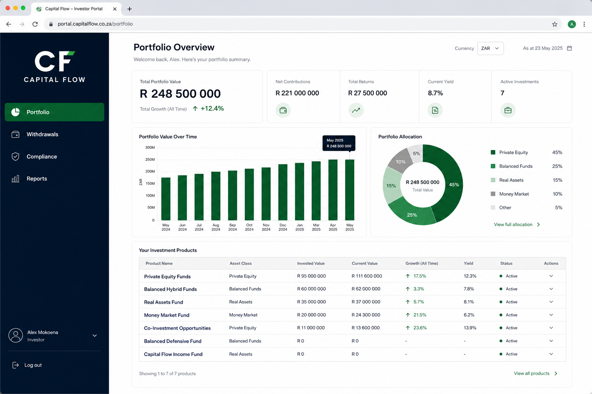
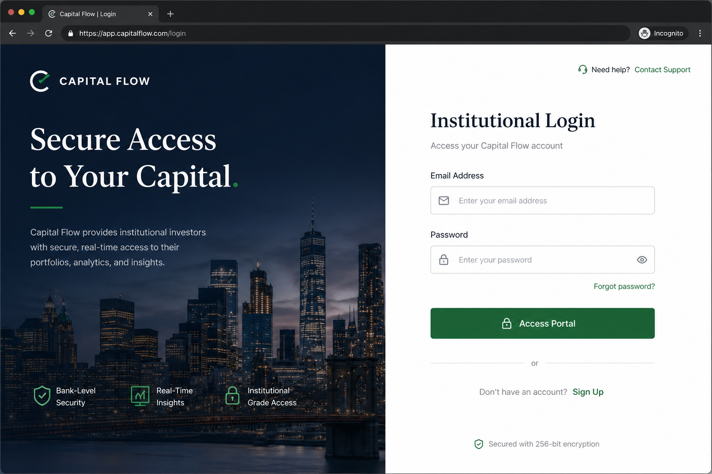
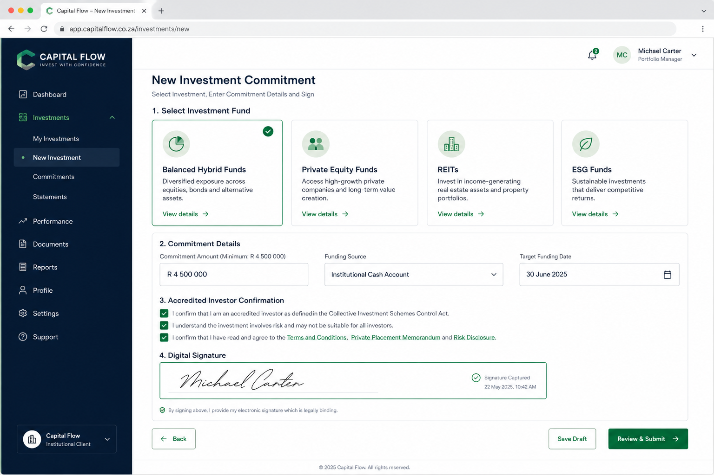
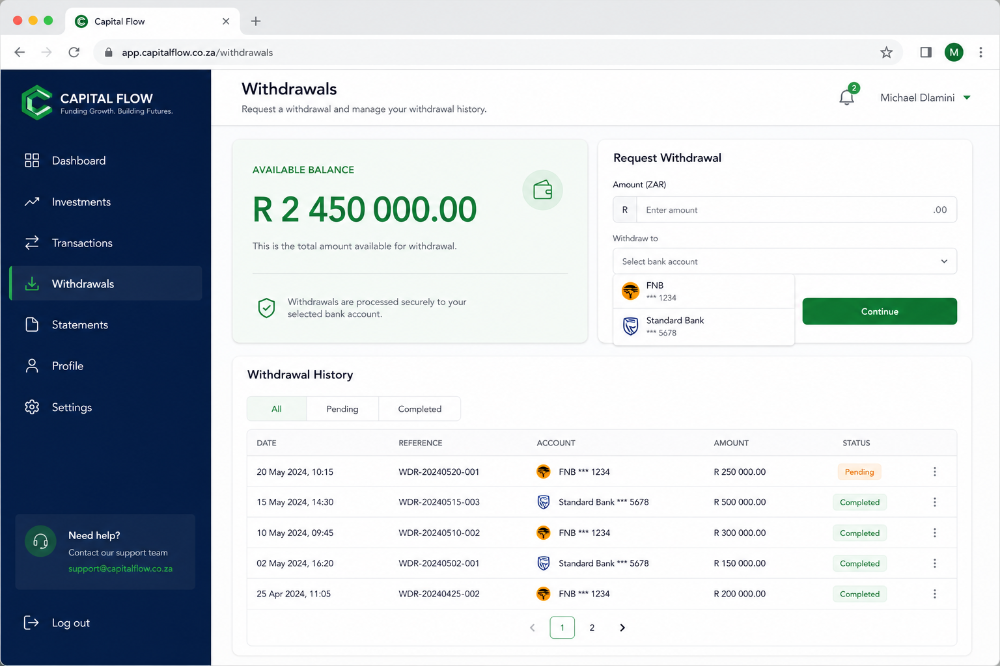

# Capital Flow

Institutional investor portal for **Fanele & Partners** — portfolio analytics, withdrawals, compliance monitoring, reports, and new investment commitments. The frontend is static HTML/CSS/JS; the backend is a Spring Boot REST API with session-based authentication.



---

## Features

| Area | Description |
|------|-------------|
| **Portfolio** | Total value, growth, allocations, performance by fund, recent activity |
| **Withdrawals** | Balance, 90% cap, retirement rules (age > 65), CSV export |
| **Investments** | Seven fund catalogue, min R 4.5M commitment, digital signature |
| **Compliance** | Pass rate, rule health, active breach alerts |
| **Reports** | Statement / tax / analysis documents with download |
| **Profile** | Personal info, 2FA toggle, notification preferences |

Currency is displayed in **South African Rand (ZAR)** throughout the UI.

---

## Tech stack

| Layer | Technology |
|-------|------------|
| Frontend | HTML5, CSS3, vanilla JavaScript |
| Backend | Java 26 (JDK 26.0.1), Spring Boot 4.0.6 |
| Persistence | H2 (file-backed), Spring Data JPA |
| Security | Spring Security, BCrypt, HTTP session (`JSESSIONID`) |
| Validation | Jakarta Bean Validation (backend), `js/validation.js` (frontend) |

---

## Prerequisites

- **Java 26** (JDK 26.0.1)
- **Maven** (included via `backend/mvnw.cmd`)
- A terminal (PowerShell on Windows)

Verify Java:

```powershell
java -version
```

---

## Setup & run

### 1. Clone / open the project

```text
Project_03/
├── pages/              # HTML pages (index, landing, login, etc.)
├── css/  js/           # Frontend assets
├── docs/screenshots/   # README screenshots
└── backend/            # Spring Boot API
```

### 2. Set `JAVA_HOME` (Windows)

Adjust the path if your JDK is installed elsewhere:

```powershell
$env:JAVA_HOME = "C:\Program Files\Java\jdk-26.0.1"
```

### 3. Start the backend

The backend serves **both** the API and the static frontend on port **8081**.

```powershell
cd backend
.\mvnw.cmd spring-boot:run
```

First startup may take 30–60 seconds while Maven downloads dependencies.

### 4. Open the app

| URL | Page |
|-----|------|
| http://localhost:8080/ | Landing (redirect) |
| http://localhost:8080/pages/login.html | Login / sign up |
| http://localhost:8080/pages/index.html | Portfolio (requires login) |

> **Important:** Open pages through `http://localhost:8080`, not as `file://` URLs. Session cookies and API calls require the backend origin.

### Demo account

| Field | Value |
|-------|-------|
| Email | `thabo@fanele.com` |
| Password | `password123` |

This user is seeded on first run (`DataSeeder.java`) and is eligible for retirement withdrawals (DOB 1957).

### H2 console (optional)

- URL: http://localhost:8080/h2-console  
- JDBC URL: `jdbc:h2:file:./data/capitalflow`  
- User: `sa` / Password: *(empty)*

### Troubleshooting

| Issue | Fix |
|-------|-----|
| Port 8080 in use | Stop the other process or change `server.port` in `backend/src/main/resources/application.properties` |
| Maven build fails / DB locked | Kill stale Java processes; H2 uses `AUTO_SERVER=TRUE` for recovery |
| API returns 401 | Log in again; protected routes require an active session |
| `JAVA_HOME` errors | Point `$env:JAVA_HOME` at your JDK 26.0.1 install |
| Login 500 / `NOTIFY_COMPLIANCE` not found | Stop the server, delete `backend/data/capitalflow.*.db` files, restart (schema migrations will re-run) |
| Prefer `mvnw spring-boot:run` over `java -jar` | Fat-jar mode can hit classpath issues after force-killing the process |

---

## Project structure (backend)

```text
backend/src/main/java/com/enviro/assessment/junior/fanelesibongesithole/
├── catalog/          # FundCatalog — single source of truth for investable funds
├── config/           # Security, seeding, schema migration
├── controller/       # REST endpoints
├── dto/              # Request/response contracts (no entities exposed)
├── exception/        # ApiException, GlobalExceptionHandler
├── repository/       # JPA + in-memory DataStore (portfolio demo data)
├── service/          # Business logic
└── validation/       # Shared regex patterns (ValidationPatterns)
```

---

## API reference

**Base URL:** `http://localhost:8080/api`  
**Auth:** Session cookie (`JSESSIONID`). Send `credentials: 'include'` from the frontend.  
**Errors:** JSON `ErrorResponse` with `timestamp`, `status`, `error`, `message`, `path`. Validation errors use `field: message` segments joined by `; `.

### Authentication

| Method | Path | Auth | Description |
|--------|------|------|-------------|
| `POST` | `/auth/register` | Public | Create account |
| `POST` | `/auth/sessions` | Public | Login |
| `DELETE` | `/auth/sessions/current` | Public | Logout |
| `GET` | `/auth/me` | Session | Current user summary |

**Register body**

```json
{
  "email": "investor@firm.com",
  "password": "password123",
  "firstName": "Thabo",
  "lastName": "Nkosi",
  "firmName": "Fanele & Partners",
  "dateOfBirth": "1980-01-15"
}
```

**Login body**

```json
{ "email": "thabo@fanele.com", "password": "password123" }
```

---

### Portfolio

| Method | Path | Description |
|--------|------|-------------|
| `GET` | `/portfolio/summary` | Full dashboard payload |

**Response (abbreviated)**

```json
{
  "totalValue": 248500000,
  "growthPercent": 12.4,
  "fundCount": 7,
  "chartData": [{ "label": "Jan", "value": 210000000 }],
  "allocations": [{ "label": "Private Equity", "percent": 25 }],
  "performanceByClass": [{ "name": "Private Equity Funds", "committed": 65000000, "invested": 58000000, "irr": 14.8 }],
  "products": [{ "id": "fund_pe", "name": "Private Equity Funds", "assetClass": "Private Equity", "committed": 65000000, "invested": 58000000, "currentValue": 62000000, "irr": 14.8 }],
  "recentActivity": [{ "type": "Capital Call", "source": "Private Equity Funds", "date": "2023-10-24", "amount": -2500000 }]
}
```

Portfolio holdings use the same fund IDs as the investment catalogue (`fund_pe`, `fund_balanced`, etc.).

---

### Withdrawals & accounts

| Method | Path | Description |
|--------|------|-------------|
| `GET` | `/withdrawals/balance` | Available balance, 90% cap, retirement eligibility |
| `GET` | `/withdrawals/transactions` | Withdrawal history |
| `POST` | `/withdrawals/request` | Submit withdrawal |
| `GET` | `/withdrawals/statements/export` | CSV export (`?status=&type=&from=&to=`) |
| `GET` | `/accounts/linked` | Linked bank accounts |

**Balance response**

```json
{
  "availableBalance": 2450000.0,
  "maxWithdrawalAmount": 2205000.0,
  "growthPercent": 2.4,
  "retirementEligible": true
}
```

**Withdrawal request**

```json
{
  "amount": 150000.00,
  "accountId": "acc_001",
  "type": "STANDARD",
  "reason": "Q3 distribution"
}
```

`type`: `STANDARD` | `RETIREMENT` (retirement requires age > 65).

---

### Investments

| Method | Path | Description |
|--------|------|-------------|
| `GET` | `/investments/funds` | List available funds |
| `GET` | `/investments/funds/{id}` | Fund detail |
| `POST` | `/investments/commitments` | Submit commitment (min R 4,500,000) |

**Commitment request**

```json
{
  "fundId": "fund_pe",
  "amount": 4500000,
  "accountId": "acc_001",
  "fundingDate": "2026-06-15",
  "accreditedInvestor": true,
  "termsAccepted": true,
  "digitalSignature": "Thabo Nkosi"
}
```

---

### User profile

| Method | Path | Description |
|--------|------|-------------|
| `GET` | `/user/profile` | Short profile (topbar) |
| `GET` | `/user/profile/detail` | Full profile + preferences |
| `PUT` | `/user/profile` | Update profile |

---

### Compliance & reports

| Method | Path | Description |
|--------|------|-------------|
| `GET` | `/compliance/summary` | Compliance dashboard |
| `GET` | `/reports` | Report catalogue |
| `GET` | `/reports/{id}/download` | Single PDF download |
| `GET` | `/reports/download-all` | ZIP of all reports |

---

## Screenshots

### Login



### Portfolio dashboard


### New investment



### Withdrawals



---

## AI usage

This project was developed with **[Cursor](https://cursor.com)** AI-assisted coding. Below is how AI was used and how to work with the codebase responsibly.

### What AI helped build

| Area | AI contribution |
|------|-----------------|
| **Backend scaffolding** | Spring Boot structure, REST controllers, DTO layer, global exception handling |
| **Security** | Session auth, `SecurityConfig`, BCrypt registration/login |
| **Domain alignment** | `FundCatalog` as single source of truth linking portfolio holdings and new investments |
| **Validation** | Jakarta Bean Validation on DTOs; mirrored rules in `js/validation.js` |
| **Frontend wiring** | API helpers (`common.js`), form flows, ZAR formatting, field-level error display |
| **Documentation** | This README, API reference, troubleshooting notes |

### Human review expectations

AI-generated code should always be **reviewed and tested** before production use:

1. **Run the app** — `.\mvnw.cmd spring-boot:run` and exercise login, portfolio, withdrawals, and investment flows.
2. **Check security** — Demo credentials are for local dev only; replace H2 with a production database and harden secrets for deployment.
3. **Validate business rules** — Withdrawal caps, retirement age, and minimum commitments are demo logic in services, not legal advice.
4. **Keep validation in sync** — If you change backend `ValidationPatterns.java`, update `js/validation.js` to match.

### Suggested Cursor prompts for this repo

```text
Add a new fund to FundCatalog and seed a portfolio holding in DataStore.
```

```text
Add a REST endpoint for X following the existing DTO + GlobalExceptionHandler pattern.
```

```text
Extend js/validation.js and the corresponding DTO constraints for field Y.
```

### What not to paste into AI tools

- Production database credentials or API keys  
- Real investor PII or account numbers  
- Unredacted session tokens from live environments  

### Replacing AI-generated screenshots

Screenshots in `docs/screenshots/` are illustrative mockups. For accurate docs, capture live UI after starting the server:

1. Log in at http://localhost:8080/pages/login.html  
2. Screenshot each page (Portfolio, Withdrawals, Investment, Profile)  
3. Save over the files in `docs/screenshots/`

---

## Development notes

- **Frontend validation:** `js/validation.js` — keep aligned with `backend/.../validation/ValidationPatterns.java`
- **Fund catalogue:** `backend/.../catalog/FundCatalog.java` — add funds here first
- **Legacy API doc:** `API_CONTRACT.md` (partially outdated; prefer this README for current contracts)

---

## License

Internal / educational use — Fanele & Partners Capital Flow demo application.
